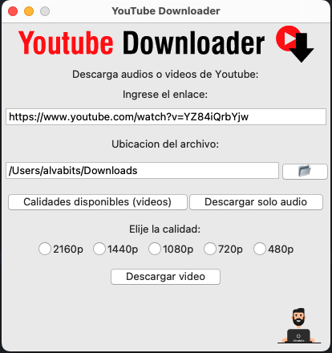

# 🖼️ YouTube Download App Multiplataforma

Aplicación de escritorio hecha con **Python** y **Tkinter**, con compatibilidad para **macOS** y **Windows**.
> ✅ 100% gratuito, multiplataforma y de código abierto

---

## 🚀 Características principales

- 🔽 Descarga videos de YouTube en cualquier duración
- 📺 Soporta resoluciones desde 144p hasta 4K (cuando esté disponible)
- 🎧 Extrae solo audio (MP3)
- 🛠️ Compilación automática para Windows desde GitHub

---

## 📸 Captura de pantalla

> 

---

## ⚙️ Tecnologías usadas

- [Python](https://www.python.org/)
- [yt_dlp](https://github.com/yt-dlp/yt-dlp)
- [Tkinter](https://docs.python.org/3/library/tkinter.html)
- [PyInstaller](https://pyinstaller.org/)
- [GitHub Actions](https://github.com/features/actions)

---

## 🧩 Requisitos

- Python 3.12 o superior
- [yt-dlp](https://github.com/yt-dlp/yt-dlp)

---

## 💻 Cómo usar

### 1. Clona este repositorio

```bash
git clone https://github.com/tu_usuario/YT_Download.git
cd YT_Download
```

### 2. Para generar el ejecutable en Windows

1. Asegúrate de tener **Python 3.12 o superior** y las dependencias necesarias instaladas.
2. Ejecuta el siguiente comando para generar el ejecutable en **Windows**:

```bash
pyinstaller main.py --name YT_Download --noconfirm --windowed --icon=images/icono.ico --add-data "images;images"
```
3. Este comando generará un ejecutable en la carpeta dist con el nombre YT_Download.exe.

### 3. Para generar el ejecutable en MacOs

1. Asegúrate de tener **Python 3.12 o superior** y las dependencias necesarias instaladas.
2. Ejecuta el siguiente comando para generar el ejecutable en **Mac**:

```bash
pyinstaller main.py --name YT_Download --noconfirm --windowed --icon=images/icon.icns --add-data "images:images"
```
3. Este comando generará el archivo YT_Download.app dentro de la carpeta dist en macOS.
<div style="background-color: #f0f0f0; padding: 10px; border-radius: 5px;">
  <strong>Nota:</strong> En macOS, es posible que al abrir el ejecutable por primera vez aparezca una advertencia de seguridad debido a que no es un software firmado. Para abrirlo, haz clic derecho sobre el archivo .app y selecciona "Abrir".
</div>

## 📥 Descargas

### Descargar la versión para Windows

Puedes descargar la versión para **Windows** desde el siguiente enlace:

- [Descargar para Windows](https://github.com/coalva94/YT_Download/actions/runs/14545574599/artifacts/2972788710)

### Descargar la versión para macOS

Puedes descargar la versión para **macOS** desde el siguiente enlace:

- [Descargar para macOS](https://github.com/coalva94/YT_Download/releases/download/v1.0.0/YT_Download.zip)

---

## 🧑‍💻 Contribuciones

Las contribuciones son bienvenidas. Si deseas ayudar a mejorar esta aplicación, por favor sigue estos pasos:

1. Haz un fork de este repositorio.
2. Crea una nueva rama:

```bash
git checkout -b feature/nueva-funcionalidad
```
3. Realiza los cambios y haz commit:
```bash
git commit -am 'Añadir nueva funcionalidad'
```
4. Empuja a tu rama:
```bash
git push origin feature/nueva-funcionalidad
```
5. Abre un pull request desde tu rama hacia la rama principal del repositorio.
```bash
Este bloque puedes agregarlo donde lo desees en tu archivo `README.md`.
```
